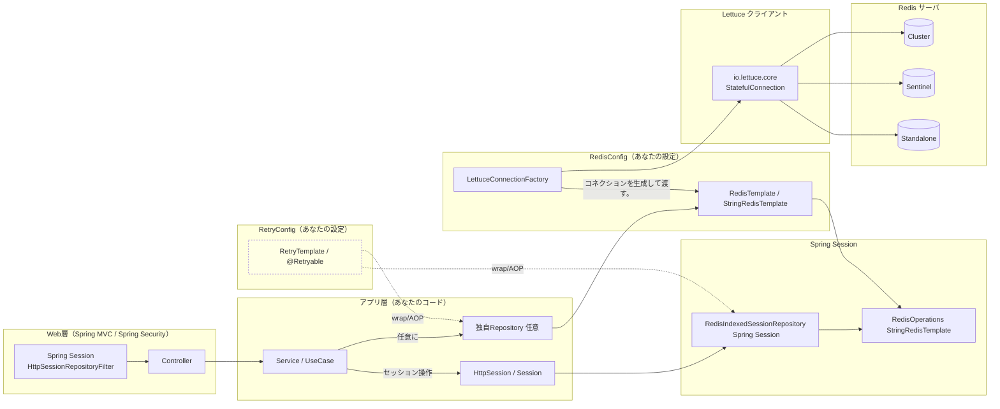
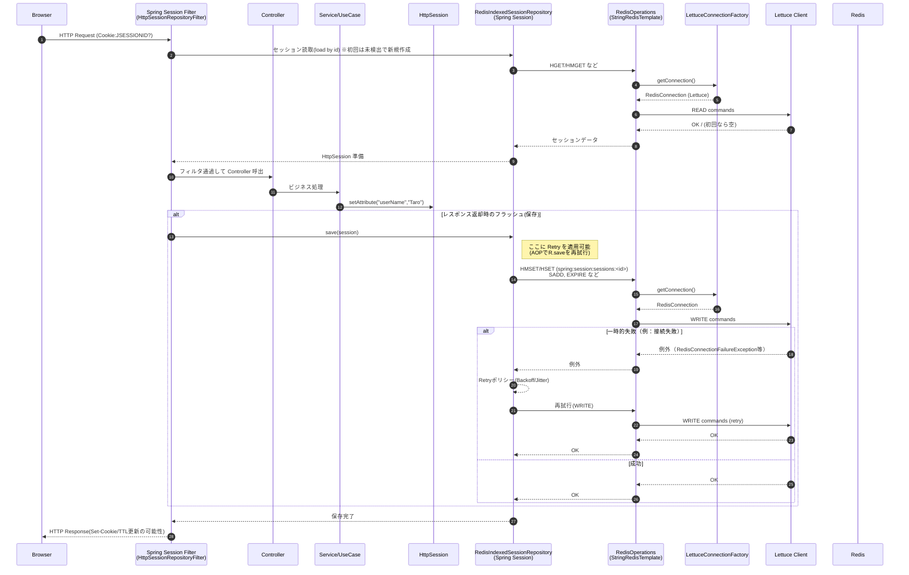
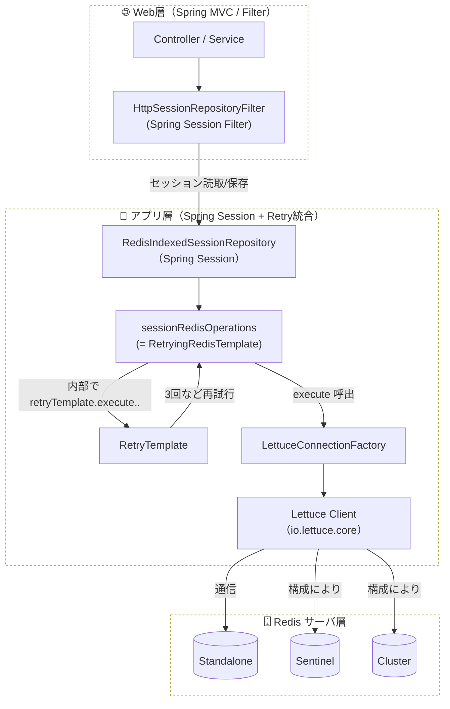
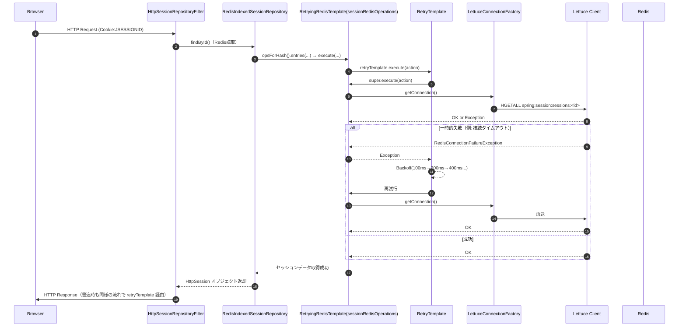

・Spring Session は RedisIndexedSessionRepository が内部で RedisOperations（= ほぼ StringRedisTemplate） を使って Redis に保存/読取。 
・LettuceConnectionFactory が接続の起点。Standalone/Sentinel/Cluster は *Configuration の渡し方で決まる。 
・Retry は AOP かラップで RedisIndexedSessionRepository や独自 Repository の Redis I/O を再試行可能。 

* Spring Session は Redis に以下のようなキーで保存するのが一般的： 
     * spring:session:sessions:<sessionId>（Hash：attrs、creationTime、lastAccessedTime…） 
     * spring:session:expirations:<epochSec>（Set：期限管理） 
* TTL/有効期限は server.servlet.session.timeout や Spring Session の設定で制御。 
* Retry を入れるなら、save/createSession/findById を横断的に AOP で再試行対象にすると現実的。 

